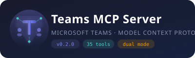

<p align="center">
  
</p>

<p align="center">
  
  
  
  
  
</p>

# Teams MCP Server

> A standalone [MCP](https://modelcontextprotocol.io/) server that exposes **Microsoft Teams**, **Calendar**, **Voice/STT**, and **Persona Meeting** capabilities. Supports two modes: **Native** (Graph API) and **Persona** (browser-based, zero Azure registration).

<p align="center">
  
  
  
  
  
  
</p>

Built for [HomePilot](https://github.com/ruslanmv/HomePilot) but works with any MCP-compatible client.

---

## Two Modes

| | Native Mode | Persona Mode |
|---|---|---|
| **Azure registration** | Required | **Not needed** |
| **How it works** | Graph API reads your meeting chat | Headless browser joins as a guest |
| **Video** | N/A (chat only) | Static face with idle animation |
| **Audio** | Via ACS (scaffold) | TTS output via virtual mic |
| **Listening** | Via ACS (scaffold) | Tab audio capture + Whisper STT |
| **Chat** | Graph API | DOM automation |
| **Best for** | Enterprise, full Graph API access | Quick start, demos, persona meetings |
| **Tools** | 27 | 8 |

---

## Quick Start — Persona Mode (No Azure, No Registration)

The fastest way to get a persona into a Teams meeting:

### 1. Install

```bash
pip install -e ".[persona]"
playwright install chromium
```

### 2. Configure (minimal)

```bash
cp .env.example .env
```

Edit `.env` — only need the encryption key:

```bash
TEAMS_MCP_TOKEN_KEY=$(python -c "from cryptography.fernet import Fernet; print(Fernet.generate_key().decode())")
```

> For persona mode, `MS_CLIENT_ID` is **not required**.

### 3. Run

```bash
teams-mcp
# Server starts on http://localhost:9106
```

### 4. Join a meeting

```bash
# Join as "Diana" with a face image
curl -s -X POST http://localhost:9106/rpc \
  -H 'Content-Type: application/json' \
  -d '{
    "method": "tools/call",
    "params": {
      "name": "teams.persona.join",
      "arguments": {
        "join_url": "https://teams.microsoft.com/l/meetup-join/...",
        "display_name": "Diana",
        "face_image": "/path/to/diana.png"
      }
    },
    "id": 1
  }'
```

Returns a `session_id` you use for all subsequent calls.

### 5. Interact

```bash
# Make the persona speak
curl -s -X POST http://localhost:9106/rpc \
  -H 'Content-Type: application/json' \
  -d '{
    "method": "tools/call",
    "params": {
      "name": "teams.persona.speak",
      "arguments": {
        "session_id": "persona-1234567890",
        "text": "Hello everyone, I am Diana, your AI assistant."
      }
    },
    "id": 2
  }'

# Post in meeting chat
curl -s -X POST http://localhost:9106/rpc \
  -H 'Content-Type: application/json' \
  -d '{
    "method": "tools/call",
    "params": {
      "name": "teams.persona.chat_post",
      "arguments": {
        "session_id": "persona-1234567890",
        "text": "Meeting notes will be shared after the call."
      }
    },
    "id": 3
  }'

# Listen to what others are saying
curl -s -X POST http://localhost:9106/rpc \
  -H 'Content-Type: application/json' \
  -d '{
    "method": "tools/call",
    "params": {
      "name": "teams.persona.listen",
      "arguments": {
        "session_id": "persona-1234567890",
        "duration_ms": 5000
      }
    },
    "id": 4
  }'

# Leave
curl -s -X POST http://localhost:9106/rpc \
  -H 'Content-Type: application/json' \
  -d '{
    "method": "tools/call",
    "params": {
      "name": "teams.persona.leave",
      "arguments": {"session_id": "persona-1234567890"}
    },
    "id": 5
  }'
```

### Persona Workflow (with HomePilot)

```bash
# Connect via HomePilot API (persona mode)
curl -X POST http://localhost:8000/v1/teams/bridge/connect \
  -H 'Content-Type: application/json' \
  -d '{
    "room_id": "room-abc-123",
    "join_url": "https://teams.microsoft.com/l/meetup-join/...",
    "mode": "persona",
    "display_name": "Diana",
    "face_image": "/data/faces/diana.png",
    "tts_voice": "en_US-amy-medium",
    "voice_enabled": true
  }'
```

---

## Quick Start — Native Mode (Graph API)

For enterprise use with full Graph API access:

### 1. Install

```bash
pip install -e .
```

### 2. Generate encryption key

```bash
python -c "from cryptography.fernet import Fernet; print(Fernet.generate_key().decode())"
```

### 3. Configure

```bash
cp .env.example .env
```

Edit `.env`:

```bash
TEAMS_MCP_MS_CLIENT_ID=<your Azure app client ID>
TEAMS_MCP_TOKEN_KEY=<the Fernet key from step 2>
TEAMS_MCP_MS_TENANT_ID=common    # or your org tenant ID
```

### 4. Run

```bash
teams-mcp
# Server starts on http://localhost:9106
```

### 5. Authenticate

```bash
curl -s -X POST http://localhost:9106/rpc \
  -H 'Content-Type: application/json' \
  -d '{"method":"tools/call","params":{"name":"teams.auth.device_code_start","arguments":{}},"id":1}'
```

Open the URL, enter the code, sign in. Then poll:

```bash
curl -s -X POST http://localhost:9106/rpc \
  -H 'Content-Type: application/json' \
  -d '{"method":"tools/call","params":{"name":"teams.auth.device_code_poll","arguments":{"device_code":"YOUR_CODE"}},"id":2}'
```

### 6. Verify

```bash
curl -s http://localhost:9106/health | python -m json.tool
# Should show 35 tools
```

---

## Overview

```
                    ┌──────────────────────────────────────────────┐
                    │           Teams MCP Server :9106              │
                    │                                              │
                    │  NATIVE MODE (27 tools)                      │
  MS Graph API ───>│    Auth · Chat · Calendar · Meetings          │<── Any MCP Client
                    │    Voice/STT · ACS Audio                     │
                    │                                              │
                    │  PERSONA MODE (8 tools)                      │
  Headless        >│    Join · Leave · Status · Set Face           │
  Chromium         │    Speak · Listen · Chat Post · Chat Read     │
                    │                                              │
                    │  Endpoints:   GET /health     POST /rpc      │
                    └──────────────────────────────────────────────┘
```

| Category | Tools | Mode | What you can do |
|---|---|---|---|
| **Authentication** | 4 | Native | Device code login, status, logout |
| **Chats** | 2 | Native | Read and send chat messages |
| **Teams & Channels** | 3 | Native | List teams, channels, send messages |
| **Calendar** | 3 | Native | Today's events, date range, join links |
| **Calls** | 1 | Native | Join meeting scaffold |
| **Meeting Chat** | 4 | Native | Resolve join URL, read/post chat, list members |
| **Meeting Sessions** | 3 | Native | Connect, status, disconnect |
| **Voice / STT** | 4 | Shared | Toggle, configure, status, transcribe audio |
| **ACS Audio** | 3 | Native | Join/leave/status via Azure Communication Services |
| **Persona Meeting** | 8 | **Persona** | Join as guest, face, speak, listen, chat |

---

## Persona Mode — How It Works

```
HomePilot                              teams-mcp-server
   │
   │── teams.persona.join ────────────► Launch headless Chromium
   │   {url, name, face_image}          Navigate to meeting URL
   │                                    Click "Join as guest"
   │                                    ◄── {session_id}
   │
   │── teams.persona.speak ───────────► piper-tts generates WAV
   │   {session_id, text}               Play to virtual mic
   │                                    Meeting hears persona speak
   │
   │── teams.persona.listen ──────────► Capture tab audio
   │   {session_id}                     Whisper STT transcribes
   │                                    ◄── {transcript}
   │
   │── teams.persona.chat_post ───────► Type in chat via DOM
   │── teams.persona.chat_read ───────► Scrape chat via DOM
   │── teams.persona.leave ───────────► Click Leave, close browser
```

### What Teams sees

- A participant named "Diana" (or whatever display name you set)
- A static face image with subtle idle animation (sway + blink)
- Voice output when the persona speaks (TTS)
- Chat messages posted by the persona

### Requirements

| Component | Purpose | Install |
|---|---|---|
| Chromium | Browser for meeting | `playwright install chromium` |
| Playwright | Browser automation | `pip install -e ".[persona]"` |
| piper-tts | Local TTS | `pip install piper-tts` or system package |
| PulseAudio/PipeWire | Virtual audio sink | Usually pre-installed on Linux |
| OpenCV (headless) | Face video generation | Included in `[persona]` extra |
| faster-whisper | STT (optional) | `pip install -e ".[whisper]"` |

---

## Azure Entra App Setup (Native Mode Only)

<details>
<summary><b>Personal / Free Account Setup</b></summary>

For personal Microsoft accounts or testing:

1. Go to [Azure Portal > App registrations](https://portal.azure.com/#blade/Microsoft_AAD_RegisteredApps/ApplicationsListBlade)
2. **New registration** > Name: `HomePilot Teams`
3. Supported account types: **Personal Microsoft accounts only** (or "Accounts in any organizational directory and personal")
4. Redirect URI: skip
5. After creation > **Authentication** > **Allow public client flows** = Yes
6. **API permissions** > Add delegated permissions (see table below)
7. Set `TEAMS_MCP_MS_TENANT_ID=common` in `.env`

</details>

<details>
<summary><b>Enterprise / Organization Setup</b></summary>

For your company's Teams with enterprise features:

1. Go to [Azure Portal > App registrations](https://portal.azure.com/#blade/Microsoft_AAD_RegisteredApps/ApplicationsListBlade)
2. **New registration** > Name: `HomePilot Teams`
3. Supported account types: **Accounts in this organizational directory only**
4. Redirect URI: skip
5. After creation > **Authentication** > **Allow public client flows** = Yes
6. **API permissions** > Add delegated permissions (see table below)
7. **Grant admin consent for [Your Org]** (requires admin)
8. Set `TEAMS_MCP_MS_TENANT_ID=<your-tenant-id>` in `.env`

Find your tenant ID: Azure Portal > Microsoft Entra ID > Overview > Tenant ID

</details>

### Required API Permissions (Delegated)

| Permission | Risk | Purpose |
|---|---|---|
| `User.Read` | Low | Read your profile |
| `Chat.Read` | Low | Read chat messages |
| `ChatMessage.Read` | Low | Read meeting chat messages |
| `ChatMember.Read` | Low | List meeting participants |
| `Calendars.Read` | Low | Read calendar events |
| `OnlineMeetings.Read` | Low | Access meeting metadata |
| `Chat.ReadWrite` | Medium | Send chat messages |
| `ChannelMessage.Send` | Medium | Send channel messages |
| `Team.ReadBasic.All` | Low | List joined teams |
| `Channel.ReadBasic.All` | Low | List channels |

---

## Enterprise: Connecting to Your Company's Teams

If you have an enterprise Teams account and HomePilot running locally:

### How it works

```
Your Company's Teams Meeting
    |
    |  Microsoft Graph API (reads YOUR chat as YOU)
    v
teams-mcp-server (localhost:9106)
    |
    |  JSON-RPC
    v
HomePilot (localhost)
    |
    └── Personas read meeting chat, react, post responses back
```

### Security model

- **Authenticates as YOU** via device code flow (supports MFA, conditional access)
- **Only accesses YOUR data** — meetings you're invited to, chats you're in, teams you joined
- **Cannot access random meetings** — Graph API enforces your account's permissions
- **All data stays local** — chat text goes from Graph API to your machine, nothing is forwarded externally
- **Your org's auth policies apply** — SSO, MFA, conditional access all work normally

### What your IT admin needs to do (once)

1. Register the app in Azure Entra ID (see Enterprise Setup above)
2. Grant admin consent for the delegated permissions
3. Share the Client ID with you

**Pitch to IT**: "It's a local app that reads my own meeting chats so my AI assistant can help during meetings. It uses my credentials, runs on my machine, and follows all our org's auth policies."

### What each user needs

- A Microsoft 365 account (work or school) with Teams access
- The `MS_CLIENT_ID` from the single app registration
- Run `teams.auth.device_code_start` once to authenticate

---

## Cost

| Component | Cost |
|---|---|
| Azure Entra app registration | **Free** |
| Device code auth flow | **Free** |
| Microsoft Graph API (chat, calendar) | **Free** (included with M365 license) |
| Persona mode (browser join) | **Free** (no Azure needed) |
| piper-tts (local TTS) | **Free** (runs on CPU) |
| Whisper (local STT) | **Free** (runs on CPU) |
| Deepgram (cloud STT) | ~$0.0043/min |
| Azure Speech (cloud STT) | 5 hours free/month, then ~$1/hour |
| ACS audio capture (future) | ~$0.004/min (~$0.24/hour) |

> Both native and persona modes are **completely free** when using local STT/TTS.

---

## Environment Variables

| Variable | Required | Default | Description |
|---|---|---|---|
| `TEAMS_MCP_TOKEN_KEY` | Yes | — | Fernet key for token encryption |
| `TEAMS_MCP_MS_CLIENT_ID` | Native only | — | Azure app client ID |
| `TEAMS_MCP_MS_TENANT_ID` | No | `common` | Your org's tenant ID |
| `TEAMS_MCP_HOST` | No | `0.0.0.0` | Server bind address |
| `TEAMS_MCP_PORT` | No | `9106` | Server port |
| `TEAMS_MCP_LOG_LEVEL` | No | `INFO` | Log level |
| `TEAMS_MCP_PERSONA_CHROME_PATH` | No | auto | Custom Chromium path |
| `TEAMS_MCP_PERSONA_FACE_DIR` | No | `./data/faces` | Face images directory |
| `TEAMS_MCP_PERSONA_TTS_VOICE` | No | `en_US-amy-medium` | Default TTS voice |
| `TEAMS_MCP_PERSONA_HEADLESS` | No | `true` | Browser headless mode |
| `TEAMS_MCP_PERSONA_STT_BACKEND` | No | `whisper` | STT backend for listening |

---

## Tool Reference

### Authentication (Native Mode)

| Tool | Description |
|---|---|
| `teams.auth.device_code_start` | Start Microsoft login via device code flow |
| `teams.auth.device_code_poll` | Poll until access token is issued |
| `teams.auth.status` | Check authentication status |
| `teams.auth.logout` | Clear stored tokens |

### Chats (Native Mode)

| Tool | Description |
|---|---|
| `teams.chats.list_recent` | List recent chats (`top` parameter) |
| `teams.chats.send_message` | Send a message to a chat |

### Teams & Channels (Native Mode)

| Tool | Description |
|---|---|
| `teams.teams.list_joined` | List all joined teams |
| `teams.channels.list` | List channels in a team |
| `teams.channels.send_message` | Send a message to a channel |

### Calendar (Native Mode)

| Tool | Description |
|---|---|
| `teams.meetings.list_today` | Today's calendar events (UTC) |
| `teams.meetings.list_range` | Events in a time window (ISO timestamps) |
| `teams.meetings.get_join_link` | Get meeting join URL from event ID |

### Calls (Native Mode)

| Tool | Description |
|---|---|
| `teams.calls.join_meeting` | Join meeting as bot (requires Azure infra) |

### Meeting Chat (Native Mode)

| Tool | Description |
|---|---|
| `teams.meeting_chat.resolve` | Parse Teams join URL to extract chat thread ID |
| `teams.meeting_chat.read` | Read latest N messages from a meeting chat |
| `teams.meeting_chat.post` | Post a message to a meeting chat |
| `teams.meeting_chat.members` | List meeting participants with roles |

### Meeting Sessions (Native Mode)

| Tool | Description |
|---|---|
| `teams.meeting.connect` | Connect to a live meeting (creates tracked session) |
| `teams.meeting.status` | Check session status (or list all sessions) |
| `teams.meeting.disconnect` | Disconnect from a meeting session |

### Voice / STT (Shared)

| Tool | Description |
|---|---|
| `teams.voice.toggle` | Enable/disable speech-to-text (default: OFF) |
| `teams.voice.status` | Current voice config (backend, language, model) |
| `teams.voice.configure` | Update STT settings (partial updates OK) |
| `teams.voice.transcribe_chunk` | Transcribe base64 audio to text segments |

**Supported STT backends:**

| Backend | Type | Install | Notes |
|---|---|---|---|
| Whisper | Local (CPU/GPU) | `pip install -e ".[whisper]"` | `faster-whisper`, models: tiny/base/small/medium/large-v3 |
| Deepgram | Cloud | `pip install -e ".[deepgram]"` | WebSocket streaming, Nova-2 model |
| Azure Speech | Cloud | `pip install -e ".[azure_speech]"` | Azure Cognitive Services SDK |
| All | — | `pip install -e ".[stt]"` | Install all backends |

### ACS Audio Capture (Native Mode)

| Tool | Description |
|---|---|
| `teams.acs.join` | Join meeting via Azure Communication Services |
| `teams.acs.status` | Check ACS session status |
| `teams.acs.leave` | Leave ACS session |

> ACS tools are currently a scaffold. Full audio capture requires the
> `azure-communication-calling` SDK and an ACS resource provisioned in Azure.

### Persona Meeting (Persona Mode)

| Tool | Description |
|---|---|
| `teams.persona.join` | Join a Teams meeting as a named guest via headless browser |
| `teams.persona.leave` | Leave the meeting and close the browser |
| `teams.persona.status` | Session health check (or list all persona sessions) |
| `teams.persona.set_face` | Load a static face image for virtual camera |
| `teams.persona.speak` | TTS text and play via virtual microphone |
| `teams.persona.listen` | Capture meeting audio and transcribe via STT |
| `teams.persona.chat_post` | Post a message in meeting chat (DOM automation) |
| `teams.persona.chat_read` | Read recent meeting chat messages (DOM scraping) |

---

## Testing

```bash
pip install -e ".[test]"
make test
```

Tests cover: tool registration (35 tools), URL parsing, session lifecycle,
voice state, STT pipeline routing, ACS sessions, OAuth scopes, schema
validation, and persona tool argument validation.

---

## HomePilot Integration

Register in your MCP gateway config:

```yaml
- name: hp-teams
  url: "http://localhost:9106/rpc"
  transport: "HTTP"
  description: "Microsoft Teams MCP server"
```

Or add to `server_catalog.yaml`:

```yaml
- id: hp-teams
  port: 9106
  description: "Microsoft Teams chats, channels, calendar, meetings, and persona join"
  category: communication
  auth_type: "Device Code"
  source:
    type: external
    git: https://github.com/ruslanmv/teams-mcp-server
    ref: main
```

---

## Architecture

```
┌──────────────────────────────────────────────────────────────────┐
│                     Teams MCP Server :9106                        │
│                                                                  │
│  NATIVE MODE                           PERSONA MODE              │
│  ┌─────────┐ ┌────────┐ ┌──────────┐  ┌──────────────────────┐  │
│  │  Auth    │ │  Chat  │ │ Calendar │  │  Persona Meeting     │  │
│  │ 4 tools │ │ 2 tools│ │ 3 tools  │  │  8 tools             │  │
│  └────┬────┘ └───┬────┘ └────┬─────┘  │                      │  │
│       │          │           │         │  join · leave · face  │  │
│  ┌────┴──────────┴───────────┴──┐      │  speak · listen      │  │
│  │   Microsoft Graph Client     │      │  chat_post/read      │  │
│  │   (auth/ + graph/)           │      └──────────┬───────────┘  │
│  └──────────────────────────────┘                  │              │
│                                                    ▼              │
│  ┌─────────┐ ┌──────────┐ ┌──────────┐  ┌────────────────────┐  │
│  │ Voice   │ │ Meeting  │ │   ACS    │  │  Browser Engine    │  │
│  │ 4 tools │ │ Sessions │ │ 3 tools  │  │  (Playwright)      │  │
│  └────┬────┘ │ 3 tools  │ └──────────┘  │                    │  │
│       │      └──────────┘                │  Headless Chromium │  │
│       ▼                                  │  + Virtual Cam     │  │
│  ┌────────────────────┐                  │  + Virtual Mic     │  │
│  │   STT Pipeline     │◄────────────────►│  + Tab Audio Cap   │  │
│  │  Whisper|Deepgram  │   (shared)       │  + DOM Chat I/O    │  │
│  └────────────────────┘                  └────────────────────┘  │
│                                                                  │
│  ┌────────────────────┐                  ┌────────────────────┐  │
│  │   TTS Pipeline     │                  │  Face Video Gen    │  │
│  │   Piper (local)    │                  │  OpenCV (idle anim)│  │
│  └────────────────────┘                  └────────────────────┘  │
│                                                                  │
│  Endpoints:   GET /health     POST /rpc                          │
└──────────────────────────────────────────────────────────────────┘
         ▲                              ▲
         │  MS Graph API / Chromium     │  JSON-RPC
         │                              │
    MS Teams                    HomePilot / MCP Client
```

---

## Docker

```bash
cd docker
docker compose up -d
```

---

## Contributing

1. Fork the repo
2. Create a feature branch
3. Add tests for new tools
4. Run `make test`
5. Submit a PR

---

## License

```
Copyright 2026 Teams MCP Server Contributors

Licensed under the Apache License, Version 2.0 (the "License");
you may not use this file except in compliance with the License.
You may obtain a copy of the License at

    http://www.apache.org/licenses/LICENSE-2.0

Unless required by applicable law or agreed to in writing, software
distributed under the License is distributed on an "AS IS" BASIS,
WITHOUT WARRANTIES OR CONDITIONS OF ANY KIND, either express or implied.
See the License for the specific language governing permissions and
limitations under the License.
```
